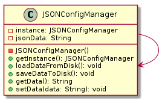
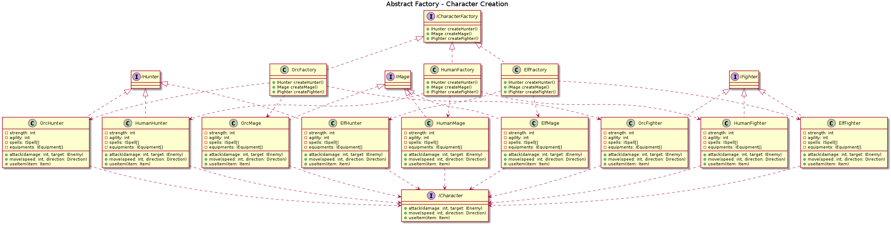
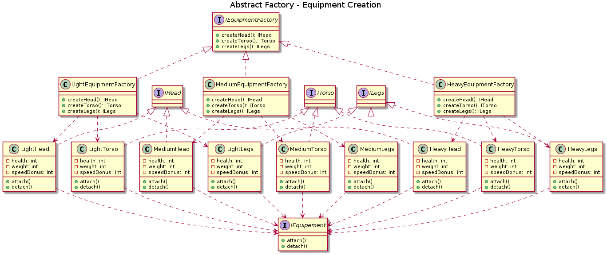
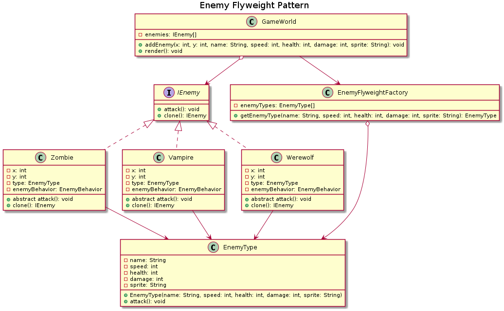
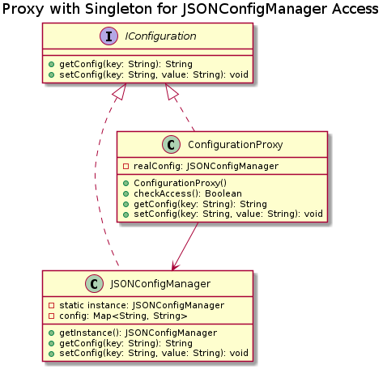
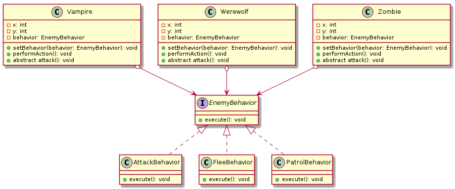
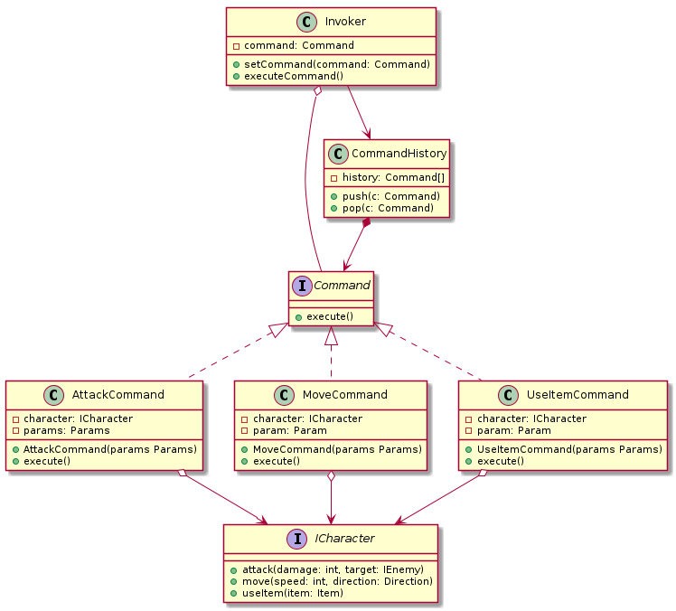

# **Design Pattern - Vampire Survivor**

## **Table des matières**

-   [I. Pattern de création](#i-pattern-de-création)
    -   [Singleton](#singleton)
        -   [Gestionnaire de configuration](#gestionnaire-de-configuration)
    -   [Factory Method](#factory-method)
        -   [Création des armes](#création-des-armes)
        -   [Création des sorts](#création-des-sorts)
        -   [Création des ennemis](#création-des-ennemis)
        -   [Création des collectibles](#création-des-collectibles)
    -   [Abstract Factory](#abstract-factory)
        -   [Création du personnage](#création-du-personnage)
        -   [Création des équipements](#création-des-équipements)
    -   [Builder](#builder)
        -   [Construction de niveaux](#construction-de-niveaux)
    -   [Prototype](#prototype)
        -   [Clone des ennemis](#clone-des-ennemis)
-   [II. Pattern structurel](#ii-pattern-structurel)
    -   [Decorator](#decorator)
        -   [Personnalisation des personnages](#personnalisation-des-personnages)
        -   [Ajouter des caractéristiques aux sorts](#ajouter-des-caractéristiques-aux-sorts)
        -   [Ajouter des améliorations à des armes](#ajouter-des-améliorations-à-des-armes)
    -   [Flyweight](#flyweight)
        -   [Textures et sprites](#textures-et-sprites)
        -   [Ennemis](#ennemis)
    -   [Proxy](#proxy)
        -   [Sauvegarde de la configuration](#sauvegarde-de-la-configuration)
-   [III. Pattern comportemental](#iii-pattern-comportemental)
    -   [Observer](#observer)
        -   [Systèmes d'évènements de jeu](#systèmes-dévènements-de-jeu)
    -   [Strategy](#strategy)
        -   [Stratégie d'ennemie](#stratégie-dennemie)
        -   [Gestion des armes](#gestion-des-armes)
    -   [Command](#command)
        -   [Actions du joueur](#actions-du-joueur)
    -   [State](#state)
        -   [Etat des personnages](#etat-des-personnages)
        -   [Etat de phase de niveau](#etat-de-phase-de-niveau)
    -   [Memento](#memento)
        -   [Sauvegarde des états du jeu](#sauvegarde-des-états-du-jeu)
    -   [Mediator](#mediator)
        -   [Médiateur du jeu](#médiateur-du-jeu)
    -   [Chain of Responsibility](#chain-of-responsibility)
        -   [Requête de jeu](#requête-de-jeu)
    -   [Template Method](#template-method)
        -   [Génération de niveaux](#génération-de-niveaux)

> **Heures de travail:**
> BEAUCOUP TROP pour tous ces diagrammes, des heures d'appels avec Julien, Joé et Isamet sur discord.

# Diagramme global

Voici le diagramme global regroupant l'intégralité des diagrammes.

> Fichier UML : [all-diagrams](UML/diagram.plantuml)

# I. Pattern de création

## Singleton

Le pattern Singleton garantit qu'une classe n'a qu'une seule instance et fournit un point d'accès global à cette instance.

### Gestionnaire de configuration\*

Pour lire et écrire des paramètres de jeu à partir d'un fichier JSON ou d'une base de données.

> Fichier UML : [configuration.singleton](UML/Singleton/configuration.singleton.plantuml)

## Factory Method

Le pattern Factory Method définit une interface pour créer un objet, mais laisse les sous-classes décider de la classe à instancier.

### Création des armes

Le joueur aura une arme de base, et pourra en acheter ou en trouver d'autres au cours de la partie.
Les types d'armes sont : épée, arc, baguette magique

> Fichier UML : [weapon.factory-method](UML/Factory_Method/weapon.factory-method.plantuml)

### Création des sorts

Le joueur commencera avec 1 ou 2 sorts en fonction de sa classe (mage, chasseur, et guerrier). Il pourra en apprendre d'autres au cours de la partie. En bref, si tu es Mage, cela va instancier deux sorts de Mage, etc.

> Fichier UML : [spell.factory-method](UML/Factory_Method/spell.factory-method.plantuml)

### Création des ennemis

Le but étant de créer différents types d'ennemis comme des zombies, des vampires ou des loups-garous en fonction du niveau ou de la zone.

> Fichier UML : [enemy.factory-method](UML/Factory_Method/enemy.factory-method.plantuml)

### Création des collectibles

Le joueur pourra ramasser des collectibles comme des pièces d'or ou de l'expérience lui permettant de monter en niveau.

> Fichier UML : [collectible.factory-method](UML/Factory_Method/collectible.factory-method.plantuml)

## Abstract Factory

Le pattern Abstract Factory fournit une interface pour créer des familles d'objets liés ou dépendants sans spécifier leurs classes concrètes.

### Création du personnage

Lors de la création du personnage, possibilité de choisir sa classe (mage, guerrier, assassin, archer) avec pour chacune des spécificités, ainsi que sa race (humain, elfe, orc) avec pour chacune des spécificités

> Fichier UML : [character.abstract-factory](UML/Abstract_Factory/character.abstract-factory.plantuml)

### Création des équipements

Le joueur aura un équipement pour chacune des parties de son corps (tête, torse, jambes) et le matériel de l'armure (légère, moyenne, lourde) avec pour chacune des spécificités.

Un magicien commencera avec un équipement léger par défaut, un guerrier avec un équipement moyen par défaut et un archer avec un équipement léger par défaut. En bref, en fonction de la classe du personnage, l'équipement de base sera différent.

Un équipement aura des statistiques (défense, vitesse, etc) qui pourront être améliorées au cours de la partie.

> Fichier UML : [equipment.abstract-factory](UML/Abstract_Factory/equipment.abstract-factory.plantuml)

## Builder

Le pattern Builder sépare la construction d'un objet complexe de sa représentation afin que le même processus de construction puisse créer différentes représentations.

### Création de personnages

On n'utilise pas de Builder pour la création des personnages car on a déjà une abstract factory. La Fabrique est souvent utilisée dès le début de la conception (moins compliquée et plus personnalisée grâce aux sous-classes) et évolue vers la Fabrique abstraite, le Prototype, ou le Monteur (ce dernier étant plus flexible, mais plus compliqué).

### Construction de niveaux

Un `LevelBuilder` pourrait assembler des niveaux de jeu complexes en ajoutant des ennemis, des objets, et des décorations de manière structurée.

> Fichier UML : [level.builder](UML/Builder/level.builder.plantuml)

## Prototype

### Clone des ennemis

Le but étant de cloner les ennemis pour éviter de les recréer à chaque fois qu'ils apparaissent. Il y a un registre qui va stocker les ennemis clonés qui permet de stocker des ennemis qui ont déjà été copiés.

> Fichier UML : [enemy.prototype](UML/Prototype/enemy.prototype.plantuml)

# II. Pattern structurel

## Adapter

Le pattern Adapter permet à des interfaces incompatibles de travailler ensemble en convertissant l'interface d'une classe en une interface attendue par les clients.

Dans notre cas, on ne veut pas utiliser ce pattern car on n'a pas besoin de convertir une interface en une autre interface dès le début du projet.

## Bridge

Le pattern Bridge sépare une abstraction d'une implémentation afin qu'elles puissent évoluer indépendamment.

Pas utile, cela pourrait l'être si on souhaitait avoir un jeu en 2D et le même en 3D où les mécanismes de rendu seraient différents

## Composite

Le pattern Composite permet de composer des objets en structures arborescentes pour représenter des hiérarchies de parties et de tout.

Pas utile, cela pourrait l'être si, par exemple, les ennemis étaient regroupés en divisions, armées, etc...

## Decorator

Le pattern Decorator attache dynamiquement des responsabilités supplémentaires à un objet. Il fournit une alternative flexible à la sous-classes pour étendre les fonctionnalités.

### Personnalisation des personnages

L'ajout d'un des décorateurs pour des compétences ou des pouvoirs spéciaux sans modifier la classe de base du personnage.

> Fichier UML : [character.decorator](UML/Decorator/character.decorator.plantuml)

### Ajouter des caractéristiques aux sorts

Pour chacun de ces sorts, un élément pourra lui être affecté afin de modifier les statistiques/caractéristiques :

-   Feu
-   Eau
-   Terre
-   Air

> Fichier UML : [spell.decorator](UML/Decorator/spell.decorator.plantuml)

### Ajouter des améliorations à des armes

On souhaite pouvoir améliorer les armes au cours de la partie, par exemple, une épée de base peut être décorée avec des capacités supplémentaires comme des enchantements (dégats bonus) de feu, d'eau, de terre et d'air et d'air ainsi que des effets associés.

> Fichier UML : [weapon.decorator](UML/Decorator/weapon.decorator.plantuml)

## Facade

Le pattern Façade fournit une interface unifiée à un ensemble d'interfaces dans un sous-système. Il définit une interface de haut niveau qui rend le sous-système plus facile à utiliser.

On ne va pas utiliser ce pattern car on n'a pas besoin de simplifier l'interface d'un ensemble d'interfaces.

## Flyweight

Le pattern Flyweight utilise le partage pour prendre en charge efficacement un grand nombre d'objets de granularité fine.

-   **Textures et sprites** : Réutiliser les mêmes textures pour plusieurs instances d'objets visuels.

> Fichier UML générique : [flyweight](UML/Flyweight/flyweight.plantuml) : le fichier est générique et ne correspond pas à un exemple précis.

> Diagramme de séquence : [flyweight.sequence](UML/Flyweight/flyweight.sequence.plantuml)

-   **Ennemis** : Réutiliser les mêmes ennemyType (état intrinsèque) pour plusieurs instances d'ennemis.

> Fichier UML : [ennemy.flyweight](UML/Flyweight/ennemy.flyweight.plantuml)

## Proxy

Le pattern Proxy fournit un substitut ou un placeholder pour un autre objet afin de contrôler l'accès à celui-ci.

### Sauvegarde de la configuration

Utiliser un proxy pour sauvegarder la configuration du jeu dans un fichier JSON qui peut servir de pare-feu en controllant les accès, donc le client ne peut pas accéder directement au fichier JSON / base de données. On pourra utiliser ce proxy pour gérer les logs et si on fait une requete pour la sauvegarde on pourra la sauvegarder pour pouvoir la re-éxecuter en cas de soucis. Mais également on pourra en mettre en cache les requêtes récurrentes pour éviter de les refaire.

> Fichier UML : [save.proxy](UML/Proxy/save.proxy.plantuml)

# III. Pattern comportemental

## Observer

Le pattern Observer définit une relation de dépendance un-à-plusieurs entre des objets, de sorte que lorsque l'un des objets change d'état, tous ses dépendants en sont informés et mis à jour automatiquement.

### Systèmes d'évènements de jeu

Pour gérer les notifications de changement d'état des objets de jeu, comme les équipements qui changent en fonction des bonus ou les personnages qui réagissent aux changements de l'environnement, ou les personnages et ennemis.

> Fichier UML : [event.observer](UML/Observer/event.observer.plantuml)

## Strategy

### Stratégie d'ennemie

Permettre aux ennemis d'adopter différentes stratégies de combat ou de déplacement en fonction de leur situation (par exemple, en combat de boss ou en patrouille).

> Fichier UML : [enemy.strategy](UML/Strategy/enemy.strategy.plantuml)

### Gestion des armes

Utiliser différentes stratégies de tir pour des armes variées (tir en ligne droite, tir en éventail, etc.).

> Fichier UML : [weapon.strategy](UML/Strategy/weapon.strategy.plantuml)

## Command

Le pattern Command encapsule une requête en tant qu'objet, permettant de paramétrer les clients avec des files d'attente, des demandes et des opérations réversibles. Si on a besoin d’une implémentation de undo/redo (reversible operations), on utilise ce pattern car c’est dynamique, au runtime, on peut choisir exécuter une commande Turn on TV mais 5 minutes après on peut turn off la TV.

### Actions du joueur

Encapsuler les actions du joueur (attaquer, déplacer, utiliser un objet) en commandes, permettant de les mettre en file d'attente, de les annuler ou de les répéter.

> Fichier UML : [player.command](UML/Command/player.command.plantuml)

## State

Le pattern State permet à un objet de modifier son comportement lorsque son état change. Il apparaît comme si l'objet changeait de classe.

### Etat des personnages

Gérer les états d'un personnage comme normal, empoisonné, enragé, etc., en modifiant son comportement en fonction de son état actuel.

> Fichier UML : [character.state](UML/State/character.state.plantuml)

### Etat de phase de niveau

Gérer les différentes phases d'un niveau de jeu (exploration, combat, boss) en changeant l'état de la scène.

> Fichier UML : [level.state](UML/State/level.state.plantuml)

## Visitor

On utilise ce pattern lorsque on doit faire un certain type d’opérations sur un groupe d’objets (la plupart du temps complexe) sans devoir altérer tout le code.

Dans notre cas, on a pas trouvé l'utilité de l'utiliser.

## Memento

Le pattern Memento capture et externalise l'état interne d'un objet sans violer l'encapsulation, permettant à l'objet de revenir à cet état plus tard. Utile pour implémenter une fonctionnalité annuler (retour en arrière), mais est également indispensable pour les transactions —> faire un snapchot, qui permet de faire un backup et de revenir à un état intérieur. Peut être utile aussi pour la sérialisation en C#.

### Sauvegarde des états du jeu

Il permet de sauvegarder l'état du jeu à des moments critiques et de restaurer cet état plus tard, par exemple pour des fonctionnalités de sauvegarde/chargement ou de retour en arrière.

> Fichier UML : [game.memento](UML/Memento/game.memento.plantuml)

## Mediator

Le pattern Mediator définit un objet qui encapsule la façon dont un ensemble d'objets interagit. Le Mediator favorise la faible connexion en évitant que les objets se réfèrent explicitement les uns aux autres.

### Médiateur du jeu

Le médiateur du jeu gère les interactions entre les objets de jeu, comme les personnages, les ennemis, les objets, etc., en évitant les dépendances directes entre eux. Il est nécessaire que cela ne devienne pas une clase dieu.

> Fichier UML : [game.mediator](UML/Mediator/game.mediator.plantuml)

## Chain of Responsibility

Le pattern Chain of Responsibility évite de coupler l'expéditeur d'une requête à son destinataire en donnant à plus d'un objet la possibilité de traiter la requête. Il enchaîne les objets récepteurs et passe la requête le long de la chaîne jusqu'à ce qu'un objet la traite.

### Requête de jeu

Elle part de l'IHM jusqu'au traitement de la requête, et il y aura différent handlers : ValidationHandler qui valide l'entrée utilisateur, ensuite si validation on passe la chaine qui va envoyer la requete via la CommandHandler, et suite à cette commande on passe le relai au DisplayHandler qui va afficher le résultat.

> Fichier UML : [request.chain-of-responsibility](UML/Chain_Of_Responsibility/request.chain-of-responsibility.plantuml)

## Template Method

Le pattern Template Method définit le squelette d'un algorithme dans une méthode, en déléguant certaines étapes aux sous-classes. Le Template Method permet aux sous-classes de redéfinir certaines étapes de l'algorithme sans changer la structure de l'algorithme.

### Génération de niveaux

Le but est de définir un processus de génération de niveaux différent niveaux tel qu'une grotte et un donjon, en laissant les sous-classes définir les détails de la génération. Il y a une méthode commune (template method) qui va générer le niveau (appeler les différentes méthodes), mais les sous-classes peuvent définir les détails de la génération (permet d'étendre certaines étapes de l'algorithme sans changer la structure de l'algorithme).

> Fichier UML : [level.template-method](UML/Template_Method/level.template-method.plantuml)

## Iterator

Le pattern Iterator fournit un moyen d'accéder séquentiellement aux éléments d'un agrégat sans exposer sa représentation sous-jacente.

On se sert de collection simple donc il serait exégaré d'utiliser ce pattern dans notre cas.

---

Réalisé par Julien, Isamet, et Joé.
